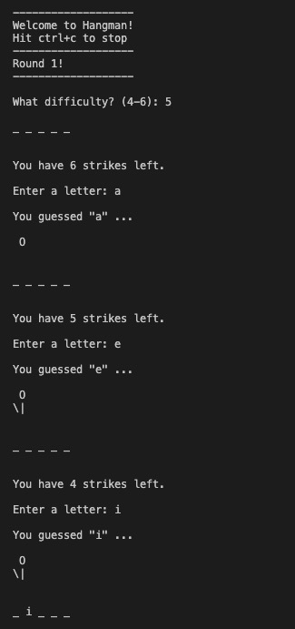

# hangman

Albany Can Code: Javascript Fundamentals, Fall '20 cohort midterm assignment. It's a Javascript hangman guessing game!

### Rules:

1. Enter "y" or "yes" at the start to play. To stop, enter "n" or "no" when asked to play, or hit ctrl+c to exit at any time.
2. Select a difficulty (4-6), which will determine the length of the random mystery word for that round.
3. Player wins when all letters are guessed correctly.
4. Player loses after 6 "strikes." Only incorrect guesses count as strikes. Repeat guesses will prompt the user for a different guess.
5. Rounds played and rounds won are displayed at the start of a new game.

### Coding features:

- Selectable difficulties
- Hanged-man visual counter
- Higher order functions (map() and reduce())
- Closures
- Currying
- RegEx
- Arrow functions
